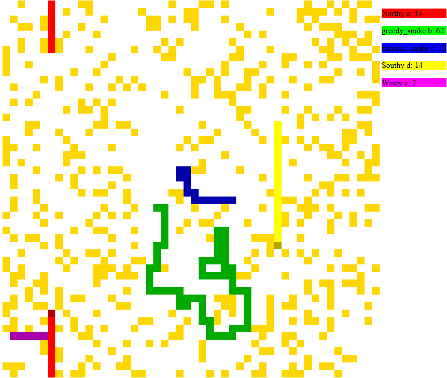

# Snakes!

The goal of this challenge is to write a bot that will play the [Snake computer game](https://en.wikipedia.org/wiki/Snake_(video_game)) competitively against other bots.  I'm sure we've all played it, but a refresher on the rules:

1. Snakes try to navigate around the map eating apples.  The map is toroidal--that is, you can go off the top and come up the bottom (and vice versa) and go off the left and come in on the right (and vice versa).
2. Every time a snake eats an apple, it grows longer.  It will start at 3 squares long, and every apple adds one square.
3. Longer snakes move slower: A 3-length snake will move on every third tick of the game clock, an 8-length on every eighth tick of the game clock, and so forth.
4. Colliding with another snake (including yourself) will cause your snake to die.  It will stop moving, but remain on the grid as a hazard for the other players.  "Collision" is defined as attempting to move into a cell already occupied by a snake.
5. The game will end when all snakes are dead, all apples are eaten, or a pre-determined number of ticks of the game clock have elapsed.  Each snake will earn 1 point for each apple its eaten, and the snake with the most cumulative points over a large number of games (maybe 100?) will be the winner?

# How To Play

The game is implemented in JavaScript.  Your responsibility is to write the move function for a snake that takes one parameter, a partially-obscured world map.  (You have limited vision; right now, you can see a square centered on your snake's head with radius your snake's length, but I might change that.  Cells outside of your field of vision are replaced with "?".)  The function has to return `n`, `e`, `s`, or `w` (not case sensitive), representing one of the cardinal directions.  Invalid output will result in your snake repeating its last move (that is, moving "forward" without turning); a 180-degree turn, such as returning `w` when your last move was `e`, is considred invalid.

Your snake is implemented as a doubly-linked list where the nodes each have a `.row` and `.col` representing their row and column in the grid (0-indexed, natch).  Your snake's head is, unsurprisingly, `this.head`, the second cell is `this.head.next`, the last cell is `this.tail`, and so forth.  In addition, you have access to the following:

* `this.letter`: The letter that represents your snake on the map.  (Normally lower case; the head is capitalized.)
* `this.length`: The length of your snake
* `this.score`: How many points you've earned
* Any other instance variables you'd like, assuming they're set within the move function
* `mod`: A custom mod function I wrote (took from StackExchange) that handles negative numbers "correctly".  If your snake's head is in the top row, `(snake.head.row - 1) % map.length` will return -1, but `mod(snake.head.row - 1, map.length)` will return map.length - 1 for proper indexing.

I wrote some example bots.  There's not competitive (or, at least, they shouldn't be), but they show the API.

```javascript
function random_snake(){
	return "NEWS"[Math.floor(Math.random()*4)] 
}

function greedy_snake(map){
	if(map[mod(this.head.row-1, map.length)][this.head.col]=="*"){
		return "n"
	} else if(map[mod(this.head.row+1, map.length)][this.head.col]=="*") {
		return "s"
	} else if(map[this.head.row][mod(this.head.col-1, map.length)]=="*") {
		return "w"
	} else if(map[this.head.row][mod(this.head.col+1, map.length)]=="*") {
		return "e"
	} else {
		return "?" // Remember, invalid input is treated as "continue in the same direction"
	}
}

function diagonal(){
	this.last_north = !this.last_north
	if(this.last_north){
		return "e"
	} else {
		return "n"
	}
}

function spiral(){
	// This could lead to excellence, or serious injury
	// https://www.youtube.com/watch?v=2aeOBZ7gVPY
	if(!this.dir_index){ this.dir_index = 1 }
	if(!this.side_length){ this.side_length = 3}
	if(!this.counter){ 
		this.counter = Math.ceil(this.side_length/this.length)
		this.side_length++
	} else {
		this.counter--
	}
	
	dirs = ["e", "n", "w", "s"]

	return dirs[this.side_length % 4]
}

function apple_turnover(){
	// Turns every time it eats an apple
	dirs = ["e", "s", "w", "n"]
	return dirs[this.score % 4]
}
```

# I Want to Watch!

You're in luck, because I wrote a quick-and-dirty Angular app to watch a replay of a game.  First, in the controller, add any bots you like to the `bots` array, then make sure the line that says `snakes(bots, keep_log=true)` is uncommented.  This will save a history of the game as a JSON into `log.js`.  Then just open `watch_replay.html` in your favorite browser and you'll watch an animated recap, complete with running scores.  Depending on preference, you may want to adjust the size of the individual cells (the height and width of `div.cell`s in `replay.css`) or the time between frames (the `TIMER_INTERVAL`	variable in `watch_replay.html`).

